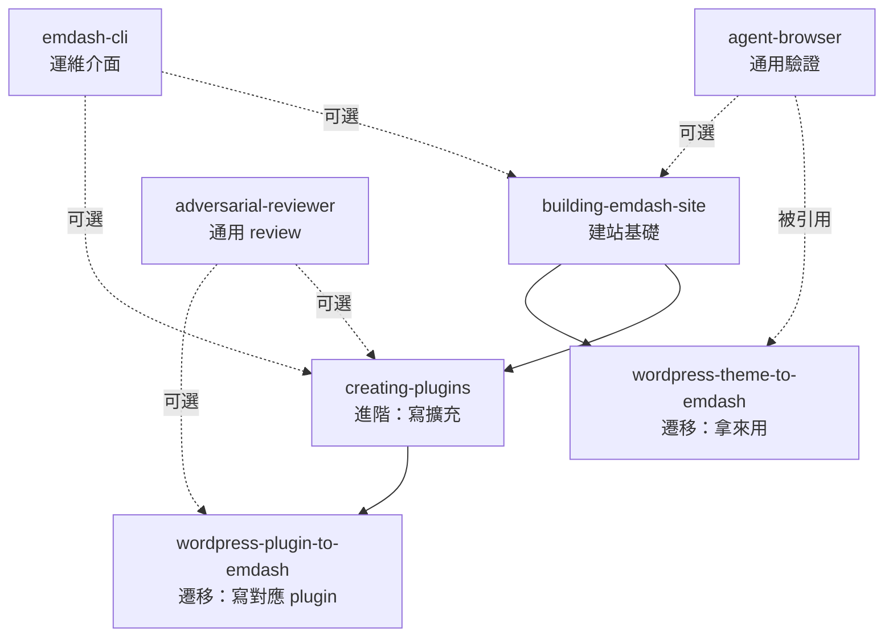

# EmDash 內建 7 個 Claude Code Skills 研究

- **日期**：2026-05-06
- **來源**：`source/skills/`（git@b3d1f40）
- **記憶 UID**：`SKILLS-EMDASH-20260506-001`
- **位置**：`/Users/chih-hungtseng/projects/EmDash/source/skills/`

---

## 0. 執行摘要

EmDash 把 7 個 Claude Code 規格的 skills 直接打包進 monorepo，**將「AI agent native CMS」這個產品主張落實為可載入的工程資產**。所有 skills 透過 YAML frontmatter（`name` + `description`）符合 Claude Code skill 規範，AI agent 載入後可立即使用。總計 **1491 行 SKILL.md + 24 個附屬 reference / phase / scaffold 檔案**。

### 7 個 skills 分三類

| 類別 | Skills | 共同特徵 |
|:---|:---|:---|
| **建置類** — 在 EmDash 上做東西 | `building-emdash-site`、`creating-plugins`、`emdash-cli` | 給「在 EmDash 工作」的 agent 用 |
| **遷移類** — 從 WordPress 換過來 | `wordpress-plugin-to-emdash`、`wordpress-theme-to-emdash` | 對抗 WordPress 鎖定的明確策略 |
| **品質保障類** | `adversarial-reviewer`、`agent-browser` | 通用驗證工具，不限於 EmDash |

---

## 1. 各 skill 功能總覽

### 1.1 `adversarial-reviewer`（122 行，無附件）

**功能**：「敵意式」程式碼審查，假設 bug 一定存在去找。

| 項目 | 內容 |
|:---|:---|
| 觸發詞 | review code、find bugs、audit、stress-test、tear this apart、what's wrong with this |
| 心態 | Guilty until proven innocent；no compliments；no hedging；prove it（給具體輸入觸發 bug） |
| 檢查清單 | 邏輯錯誤、邊界條件、錯誤處理、並發、安全、性能、API 契約、測試漏洞 |
| 隱含規則 | 「Silence means approval」— 不提就是放行，不要寫「looks fine」浪費 token |

**對 POC 意義**：這是 EmDash 自帶的「對抗式 PR review」標準流程，可作為我們專案 PR 流程的範本參考。**通用性高，跟 EmDash 無關**。

### 1.2 `agent-browser`（139 行，無附件）

**功能**：瀏覽器自動化 CLI，給 agent 做 UI 驗證、表單測試、截圖。

| 項目 | 內容 |
|:---|:---|
| 觸發詞 | verify visual changes、test web UI、capture screenshots、debug 為何在瀏覽器不對 |
| 工具 | `agent-browser` CLI（EmDash 自家的，**不是** Playwright/Puppeteer） |
| 核心命令 | `open <url>`、`snapshot -i -c`（accessibility tree + ref）、用 `@e1`/`@e2` 之類 ref 互動 |
| 用途 | 驗證主題改版、測試 admin SPA、截圖文件 |

**對 POC 意義**：這個 CLI 是 EmDash 工具鏈的一部分，POC 階段可用它替代 Playwright 做 admin SPA 驗收。**值得試**。

### 1.3 `building-emdash-site`（146 行 + 4 references = 主要 skill）

**功能**：在 EmDash 上建站、定義 collection、寫 seed、查內容、渲染 Portable Text、設選單/分類/widget。

| 項目 | 內容 |
|:---|:---|
| Reference 檔（4 個） | `configuration.md`、`querying-and-rendering.md`、`schema-and-seed.md`、`site-features.md` |
| 已知 gotchas | 5 條公開列出（image 是 object 不是 string、`entry.id` vs `entry.data.id`、taxonomy 名稱要對齊 seed、必呼叫 `Astro.cache.set(cacheHint)`、不能用 `getStaticPaths`） |
| 標準檔案結構 | `src/live.config.ts`（loader registration）、`src/pages/`、`seed/seed.json`、`emdash-env.d.ts`（auto） |
| 強制規則 | `output: "server"` 必須開、所有頁面 server-rendered |

**重要洞察**：「`entry.id` vs `entry.data.id` 不同」是 EmDash 最常見的 silent bug — POC 寫第一個 collection 時務必注意。

**對 POC 意義**：✅ **階段 1.5 必載入**。我們要寫第一個自訂 collection 時，把這個 skill 載入即可獲得官方寫法。

### 1.4 `creating-plugins`（459 行 + 7 references — **最大的 skill**）

**功能**：寫 EmDash plugin（hooks、storage、settings、admin UI、API routes、custom Portable Text block）。

| 項目 | 內容 |
|:---|:---|
| Reference 檔（7 個） | `admin-ui.md`、`api-routes.md`、`block-kit.md`、`hooks.md`、`portable-text-blocks.md`、`publishing.md`、`storage.md` |
| Plugin 雙格式 | **Standard**（`definePlugin({ hooks, routes })` + Block Kit，可 sandboxed + marketplace）vs **Native**（React + 直存 DB + Astro 元件，host only） |
| 雙 entrypoint | `index.ts`（descriptor，build-time in Vite，**side-effect-free**）、`sandbox-entry.ts`（runtime，定義 hooks/routes，跑在 deploy server） |
| 預設 | Standard 是預設，只有需要 React/直存 DB 才升級 Native |

**重要洞察**：這份 skill 完整解釋了我們深度分析發現的「兩種 format / 兩種執行模式」二維矩陣，且指出 build-time vs request-time 的 entrypoint 必須分檔（避免 Vite 把 runtime code 拉進 build），這是公開部落格沒提的關鍵實作約束。

**對 POC 意義**：✅ **階段 3 必載入**。寫 sandboxed plugin 直接走這份。

### 1.5 `emdash-cli`（245 行 + `EDITING-FLOW.md`）

**功能**：用 `emdash` / `ec` CLI 從命令列管理 EmDash 實例。

| 項目 | 內容 |
|:---|:---|
| 本機命令（直接操作 SQLite） | `init`、`dev`、`seed`、`export-seed`、`auth secret` |
| 遠端命令（HTTP） | `types`、`login`、`logout`、`whoami`、`content`、`schema`、`media`、`search`、`taxonomy`、`menu` |
| 認證解析順序 | `--token` flag → `EMDASH_TOKEN` → `emdash login` 儲存 → dev bypass（localhost 免 token） |
| 反向代理支援 | `--header`/`-H` 多次傳 + `EMDASH_HEADERS`（newline-separated）env，**內建支援 Cloudflare Access service tokens** |
| EDITING-FLOW.md | 補充「在 CLI 編輯內容」的最佳流程 |

**對 POC 意義**：✅ **驗證 MCP / API 替代路徑**。階段 2 部署到 Cloudflare 後，可用 `emdash login --header "CF-Access-Client-Id: ..."` 從本機 CLI 操作遠端站，完全不開 admin UI。

### 1.6 `wordpress-plugin-to-emdash`（297 行）

**功能**：把 WordPress plugin 概念逐項對應到 EmDash 的 API/結構。

| WordPress | EmDash 對應 |
|:---|:---|
| `register_post_type()` | `SchemaRegistry.createCollection()` |
| `register_taxonomy()` | `_emdash_taxonomy_defs` 表 |
| `register_meta()` / ACF | Collection fields via SchemaRegistry |
| `WP_Query` | `getEmDashCollection()` |
| `wp_insert_post()` | `POST /_emdash/api/content/{type}` |
| `get_post_meta()` | `entry.data.fieldName`（型別自動） |
| `get_option()` | `getSiteSetting()` / `ctx.kv` |
| `get_bloginfo('name')` | `getSiteSetting('title')` |
| Custom tables | Plugin storage collections（`ctx.storage.<name>.put/get/query`） |
| Soft delete | 內建（`deleted_at` 欄位） |

**遷移哲學**：「Clean room, not line-by-line port — 同樣行為，不同實作」。

**對 POC 意義**：用作**對比表**理解 EmDash 的功能對等清單，比讀官方手冊更快。

### 1.7 `wordpress-theme-to-emdash`（83 行 + **6 phases + 5 references + scaffold = 11 個附件**）

**功能**：把 WordPress 主題分 6 階段移植到 EmDash。**規格化程度最高**的 skill — 包含完整 scaffold 樣板。

| Phase | 檔案 | 工作 |
|:---|:---|:---|
| 1 | `phases/1-discovery.md` | 下載主題、用 agent-browser 截圖 demo、抓圖 |
| 2 | `phases/2-design.md` | 抽 CSS 變數、字型、色彩 |
| 3 | `phases/3-templates.md` | PHP 模板 → Astro 元件 |
| 4 | `phases/4-dynamic.md` | site settings、menus、taxonomies、widgets |
| 5 | `phases/5-seed.md` | 建立 demo 內容 seed |
| 6 | `phases/6-verify.md` | 截圖比對、迭代、build |

| References | 內容 |
|:---|:---|
| `astro-essentials.md` | Astro 6 必知（ClientRouter 不再叫 ViewTransitions、Zod 4 語法、Node 22+） |
| `concept-mapping.md` | WP ↔ EmDash 核心概念對應 |
| `design-extraction.md` | 從 WP 主題抽 design token |
| `emdash-api.md` | EmDash 端 API 速查 |
| `template-patterns.md` | 常見模板模式 |

| Scaffold | 內容 |
|:---|:---|
| `scaffold/package.json` | 標準依賴 |
| `scaffold/CHECKLIST.md` | 任務清單 |
| `scaffold/src/{env.d.ts, live.config.ts}` | 起步檔 |

**強制規則（CRITICAL RULES）**：
1. 一定先複製 `scaffold/`
2. 開工前先用 agent-browser 截 demo
3. 不可硬編內容（用 `getSiteSettings()` 等）
4. 頁面必 server-rendered（不可 `getStaticPaths()`）
5. Astro 6（ClientRouter、Zod 4）+ Node 22+
6. 圖一律 `import { Image } from "emdash/ui"`

**對 POC 意義**：這是 **EmDash 對 WordPress 戰略的核心武器** — 把「主題 portability」做成 AI 可執行的 6 階段工程流程。當客戶要從 WordPress 遷站，這個 skill 是核心。

---

## 2. 設計模式分析（為什麼這樣切？）

### 2.1 規格依賴圖



兩個遷移類 skills **明確 reference** 開發類 skills（如 `wordpress-plugin-to-emdash` 寫「For implementation details, use the **creating-plugins** skill」），實現「skill 互相 dispatch」的設計，避免重複內容。

### 2.2 從這 7 個 skills 推論 EmDash 對 AI agent 的真實態度

| 訊號 | 解讀 |
|:---|:---|
| 把 skills 直接放進 monorepo | AI agent 是**第一級使用者**，不是事後想到 |
| `wordpress-theme-to-emdash` 提供 scaffold + 6 phases | EmDash 期待 AI 完成整個 WordPress 遷移專案 |
| `agent-browser` 自製而非用 Playwright | 給 agent 用的最小介面，accessibility tree + ref，不需理解 selector |
| `emdash-cli` 內建 Cloudflare Access service tokens 支援 | CI / agent 自動化操作遠端站是預期使用模式 |
| `adversarial-reviewer` 採「不誇獎」、「沉默就是 OK」 | 為 AI 設計的 token-saving 對話模式 |

**結論**：EmDash 的「AI-native」不只是內建 MCP server，更是**完整的 AI 開發工具鏈**。每個 skill 都假設 LLM 是執行者，而非人類的助手。

---

## 3. POC 載入建議

| POC 階段 | 載入哪個 skill | 為什麼 |
|:---|:---|:---|
| 階段 1.5（寫第一個 collection / 自訂頁面） | `building-emdash-site` | 5 條 gotchas 直接救命 |
| 階段 2（部署 Cloudflare）後 | `emdash-cli` | 從本機 CLI 操作遠端站 |
| 階段 3（寫 sandboxed plugin） | `creating-plugins` | 458 行 + 7 references，覆蓋全部寫 plugin 細節 |
| 任何階段做 PR 前 | `adversarial-reviewer` | 對抗式自審，找出本地 bug |
| 任何階段驗證 admin UI 變更 | `agent-browser` | accessibility tree 取代手點 |
| 如果客戶要從 WP 遷主題 | `wordpress-theme-to-emdash` | 6 phases + scaffold 整套 |
| 如果客戶要把 WP plugin 移植 | `wordpress-plugin-to-emdash` | 對應表 + clean-room 哲學 |

---

## 4. 給專案的具體應用

### 4.1 把 EmDash 7 skills 加進專案 .claude/skills

EmDash POC 專案 `.claude/skills/` 可直接 symlink 或 copy 這 7 個 skills，使本專案的 Claude Code agent 立即可用。命令範例（**先別執行，請領導確認**）：

```bash
ln -s /Users/chih-hungtseng/projects/EmDash/source/skills /Users/chih-hungtseng/projects/EmDash/poc/my-emdash-blog/.claude/skills
```

### 4.2 結合既有的全域 skills

我們既有 `~/.claude/skills/` 也有相關技能（如 `technical-research`、`code-deep-analysis`、`agile-development`）。EmDash 的 7 個 skills 與這些**不衝突**：
- 全域 skills = 通用工程方法論（研究、分析、敏捷）
- EmDash skills = EmDash 領域知識

兩者組合後，做 EmDash POC / 客戶專案時，AI 同時擁有方法論 + 領域知識。

---

## 5. 關鍵新發現（補充前次研究）

| 項目 | 之前不知道 / 想錯 | 現在知道 |
|:---|:---|:---|
| Plugin 雙 entrypoint | 以為一個檔案 | 必拆 `index.ts`（build-time）+ `sandbox-entry.ts`（runtime），混在一起會 Vite 拉錯 |
| `entry.id` vs `entry.data.id` | 沒概念 | `entry.id`=slug（URL 用），`entry.data.id`=ULID（API 用），混用 silent fail |
| Cloudflare Access service token | 以為要 SSO | CLI 直接 `--header "CF-Access-Client-Id: ..."` 兩行解決 |
| `wordpress-theme-to-emdash` scaffold 包套件 | 以為是文檔 | 真的有 `scaffold/{package.json, CHECKLIST.md, src/}` 整包可複製 |
| Theme 必呼叫 `Astro.cache.set(cacheHint)` | 公開文檔沒提 | 不呼叫的話 editor 改內容後快取不會失效 |
| Astro 6 把 `ViewTransitions` 改名 `ClientRouter`、Zod 4 語法 | 不確定 | wordpress-theme-to-emdash skill 強調這點 |

---

## 6. 完整檔案清單（24 個附屬檔案）

```
skills/
├── adversarial-reviewer/SKILL.md (122)
├── agent-browser/SKILL.md (139)
├── building-emdash-site/
│   ├── SKILL.md (146)
│   └── references/
│       ├── configuration.md
│       ├── querying-and-rendering.md
│       ├── schema-and-seed.md
│       └── site-features.md
├── creating-plugins/
│   ├── SKILL.md (459)
│   └── references/
│       ├── admin-ui.md
│       ├── api-routes.md
│       ├── block-kit.md
│       ├── hooks.md
│       ├── portable-text-blocks.md
│       ├── publishing.md
│       └── storage.md
├── emdash-cli/
│   ├── SKILL.md (245)
│   └── EDITING-FLOW.md
├── wordpress-plugin-to-emdash/SKILL.md (297)
└── wordpress-theme-to-emdash/
    ├── SKILL.md (83)
    ├── phases/
    │   ├── 1-discovery.md
    │   ├── 2-design.md
    │   ├── 3-templates.md
    │   ├── 4-dynamic.md
    │   ├── 5-seed.md
    │   └── 6-verify.md
    ├── references/
    │   ├── astro-essentials.md
    │   ├── concept-mapping.md
    │   ├── design-extraction.md
    │   ├── emdash-api.md
    │   └── template-patterns.md
    └── scaffold/
        ├── CHECKLIST.md
        ├── package.json
        ├── README.md
        ├── src/env.d.ts
        ├── src/live.config.ts
        └── tsconfig.json
```

總計：**7 SKILL.md（1491 行） + 24 附屬檔案**。
