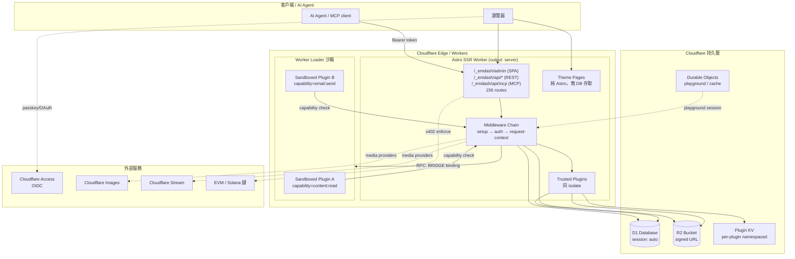
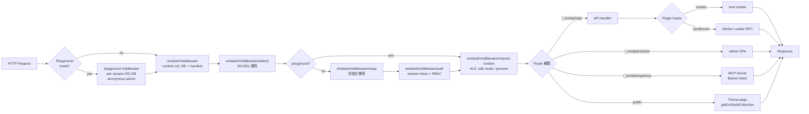
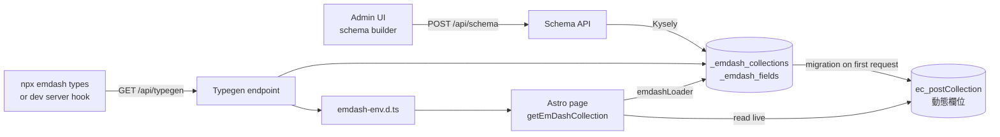

# EmDash 程式碼深度分析報告

- **日期**：2026-05-06
- **分析對象**：`emdash-cms/emdash` @ commit `b3d1f40`（main 分支）
- **本機路徑**：`/Users/chih-hungtseng/projects/EmDash/source`
- **倉庫大小**：51 MB（不含 node_modules）
- **記憶 UID**：`CODE-EMDASH-20260506-001`
- **流程**：code-deep-analysis skill v2.0（Phase 0–5）
- **前置文件**：`EMDASH_TECHNICAL_RESEARCH_REPORT_20260506.md`（同目錄）

---

## 0. 執行摘要

EmDash 是規模遠超公開文檔描述的 monorepo：**12 個 packages、10 個 templates、6 個 demos、7 個內建 Claude Code Skills、156 個 Astro 路由**，核心整合函數 345 行、Plugin Manager 含 31 個方法、MCP server 1841 行（單一 `createMcpServer` 函數）。

三項影響 POC 決策的修正：
1. **編輯器是 TipTap**（不是先前獨立評論宣稱的 TinyMCE）
2. **Plugin sandbox 用 Cloudflare 的 Worker Loader**（不是 Workers for Platforms / Dynamic Workers）
3. **MCP Server 預設啟用**（`mcp: true`），mounted 在 `/_emdash/api/mcp`，Bearer token 認證

---

## 1. Monorepo 全貌

### 1.1 packages/（12 個）

| Package | 套件名 | 角色 | 關鍵發現 |
|:---|:---|:---|:---|
| **core** | `emdash` | Astro integration、API、CLI、admin shell、MCP | `src/` 33 個子目錄，version 0.9.0 |
| **admin** | `@emdash-cms/admin` | Admin SPA（React + TanStack Router） | 24 locales、TipTap、Kumo design system、@dnd-kit |
| **auth** | `@emdash-cms/auth` | Passkey / OAuth / RBAC | `@oslojs/webauthn`，Permissions map（20+ gates） |
| **auth-atproto** | `@emdash-cms/auth-atproto` | Bluesky AT Protocol 認證 | DID-based，wildcard handle allowlist |
| **blocks** | `@emdash-cms/blocks` | Portable Text block 定義 | |
| **cloudflare** | `@emdash-cms/cloudflare` | D1/R2/Access/Sandbox 配接器 | Worker Loader RPC、自訂 Kysely D1 introspector |
| **plugins** | (workspace) | 第一方 plugins 集合 | forms、webhook-notifier、audit-log、ai-moderation、field-kit、embeds、atproto |
| **create-emdash** | `create-emdash` | scaffolding CLI | |
| **contentful-to-portable-text** | `@emdash-cms/contentful-to-portable-text` | Contentful → Portable Text | |
| **gutenberg-to-portable-text** | `@emdash-cms/gutenberg-to-portable-text` | WordPress Gutenberg → Portable Text | |
| **marketplace** | `@emdash-cms/marketplace` | Plugin marketplace 客戶端 | 配 `marketplace: "https://..."` 啟用 |
| **x402** | `@emdash-cms/x402` | HTTP 402 micropayment | EVM (`@x402/evm`) + 可選 Solana (`@x402/svm`) |

### 1.2 templates/（10 個）

`blank`、`blog`、`blog-cloudflare`、`marketing`、`marketing-cloudflare`、`portfolio`、`portfolio-cloudflare`、`starter`、`starter-cloudflare`。Cloudflare 版本與 Node 版本平行存在。

### 1.3 demos/（6 個）

`cloudflare`（產品級配置）、`playground`（DO-backed per-session DB）、`plugins-demo`、`postgres`、`preview`、`simple`。

### 1.4 skills/（7 個 Claude Code Skills，這是 EmDash 自帶的 AI 工具包）

`adversarial-reviewer`、`agent-browser`、`building-emdash-site`、`creating-plugins`、`emdash-cli`、`wordpress-plugin-to-emdash`、`wordpress-theme-to-emdash`。

### 1.5 工具鏈

- `pnpm@10.28.0` workspace、Node ≥ 22、TypeScript **6.0-beta**（!）、`@typescript/native-preview` ^7.0.0-dev
- `oxlint` + `oxfmt`（取代 ESLint/Prettier 部分）+ Prettier（Astro 檔）
- `playwright` e2e + 各 package 各自 vitest
- `knip` 死代碼檢測、`changesets` 版本管理
- 構建依賴：`better-sqlite3`、`esbuild`、`workerd`

---

## 2. 系統架構圖（Mermaid）



---

## 3. 請求生命週期 / Middleware 鏈

`emdash()` 在 `astro:config:setup` 鉤子中按以下順序註冊（皆 `order: "pre"`）：



**關鍵注解**：
- Astro 內建 `checkOrigin` 被刻意關閉，由 EmDash 自家 `checkPublicCsrf`（`api/csrf.ts`）以 dual-origin（內部 + 公開 origin）方式取代，以支援反向代理 / Docker 部署
- `request-context` 用 AsyncLocalStorage 提供 `getEmDashCollection()` 等查詢函數的執行上下文（edit mode、preview）
- Dev 模式在 server 啟動時自動 fetch `/_emdash/api/typegen` 並寫入 `emdash-env.d.ts`（workerd 沒有 fs 寫入，所以邏輯放在 Node 端）

---

## 4. Plugin 系統架構

### 4.1 Plugin 兩種「格式」與兩種「執行模式」

公開文檔的 `Native vs Sandboxed` 是**簡化版**。實際上有：

| 格式（format） | 可放於 plugins[]（trusted） | 可放於 sandboxed[] | UI | Portable Text 區塊 |
|:---|:---:|:---:|:---|:---:|
| `native` | ✅ | ❌（會擲錯） | React + adminEntry | ✅ componentsEntry |
| `standard` | ✅ | ✅ | Block Kit（無 React） | ❌ |

`integration/index.ts` 強制驗證：sandboxed 列表只接受 `format: "standard"`，native plugin 嘗試放入會 throw。

### 4.2 Hook 清單（23 個，遠超公開文檔的 6 個）

```
plugin: install / activate / deactivate / uninstall
content: beforeSave / afterSave / beforeDelete / afterDelete / afterPublish / afterUnpublish
media:   beforeUpload / afterUpload
cron
email:   beforeSend / deliver / afterSend
comment: beforeCreate / moderate / afterCreate / afterModerate
page:    metadata / fragments
```

部分 hook 為「**獨佔型**」（exclusive）— 同一時刻僅一個 plugin 可佔有，由 `EXCLUSIVE_HOOK_KEY_PREFIX` 識別、`PluginManager.setExclusiveHookSelection()` 管理。例：email transport / page fragments 註冊類 hook。

### 4.3 Capabilities（11 個 current + 11 個 deprecated alias）

**Current 命名**（namespace:action）：

```
network:request, network:request:unrestricted
content:read, content:write
media:read, media:write
users:read
email:send
hooks.email-transport:register
hooks.email-events:register
hooks.page-fragments:register
```

**Deprecated 別名**（舊命名 action:resource，仍向後相容）：
`network:fetch`、`read:content`、`write:content`、`read:media`、`write:media`、`read:users`、`email:provide`、`email:intercept`、`page:inject` …

⚠️ 公開部落格與獨立評論引用的 `read:content` 等命名為 deprecated，新文件應採 `content:read`。

### 4.4 Plugin Manager 函數依賴圖

```mermaid
flowchart TB
    subgraph PM[PluginManager class - 31 methods, 555 LOC]
        Reg[register / registerAll / unregister]
        Install[install / uninstall]
        Active[activate / deactivate]
        Init[ensureInitialized / reinitialize]
        Excl[Exclusive hooks<br/>get/setExclusiveHookSelection<br/>resolveExclusiveHooks<br/>getExclusiveHookProviders]
        Run[run* methods<br/>runContentBeforeSave<br/>runContentAfterSave<br/>...等 8 個]
        Routes[invokeRoute / getPluginRoutes]
        Cron[invokeCronHook / deleteCronTasks]
        Email[setEmailPipeline]
    end

    subgraph HP[HookPipeline - hooks.ts]
        CHP[createHookPipeline]
        REH[resolveExclusiveHooks]
    end

    subgraph DP[definePlugin - define-plugin.ts]
        DPF[definePlugin overloads ×3<br/>defineNativePlugin]
        RH[resolveHook / resolveHooks]
    end

    subgraph MS[manifest-schema.ts]
        Caps[CURRENT_PLUGIN_CAPABILITIES]
        Hooks[HOOK_NAMES]
        Schema[pluginManifestSchema<br/>routeNamePattern<br/>storageCollectionSchema<br/>dashboardWidgetSchema<br/>adminPageSchema]
    end

    subgraph CFSandbox[packages/cloudflare/sandbox]
        Wrapper[wrapper.ts<br/>code-gen JS at deploy]
        Bridge[PluginBridge RPC service]
        Runner[createSandboxRunner]
    end

    Reg --> CHP
    Install --> Init
    Run --> CHP
    CHP --> REH
    DPF --> RH
    PM -.via integration/index.ts.-> CFSandbox
    Run -->|trusted| DPF
    Run -->|sandboxed| Bridge
    Bridge --> Wrapper
    Wrapper --> Runner
    DPF --> Schema
    Schema --> Caps
    Schema --> Hooks
```

### 4.5 Sandbox 執行細節

- 配置：`worker_loaders: [{ binding: "LOADER" }]` in wrangler.jsonc
- 部署期：`packages/cloudflare/src/sandbox/wrapper.ts` 產生 wrapper JS，將 plugin manifest 元資料嵌入註解（程式碼出處可驗證）
- 執行期：host worker 透過 `LOADER` binding 載入 isolate；context（KV、storage、email、users）以 RPC 通過 BRIDGE service binding 回呼到 host
- 結果：trusted 與 sandboxed plugin 用相同 callback signature，但 sandboxed 的所有副作用必經 host 守關，capability 違規無法繞過

---

## 5. 資料流 / API 範圍

### 5.1 路由概覽（注入到 Astro 的 156 條）

| 命名空間 | 範例 | 用途 |
|:---|:---|:---|
| `/_emdash/admin/[...path]` | 管理面板 SPA | TanStack Router 處理子路由 |
| `/_emdash/api/manifest` | Manifest meta | client 啟動時拉 |
| `/_emdash/api/auth/*` | mode、passkey、oauth、magic-link | 設定不同 auth mode |
| `/_emdash/api/dashboard` | 儀表板資料 | |
| `/_emdash/api/content/[collection]` | List + Create | |
| `/_emdash/api/content/[collection]/[id]` | Get + Update + Delete | |
| `/_emdash/api/content/.../revisions` | 版本歷史 | optimistic locking via `version` column |
| `/_emdash/api/content/.../publish/unpublish/discard-draft` | 工作流 | 狀態：draft/published/scheduled |
| `/_emdash/api/content/.../trash/restore/permanent/duplicate` | 軟刪除 | `deleted_at` 欄位 |
| `/_emdash/api/content/.../compare` | Diff 兩版 | |
| `/_emdash/api/media/*` | 上傳、列表、簽名 URL | 直連 R2，繞過 25MB body limit |
| `/_emdash/api/schema/*` | Schema CRUD | Database-first |
| `/_emdash/api/typegen` | 從 schema 產 TS types | dev server 自動觸發 |
| `/_emdash/api/mcp` | MCP Streamable HTTP | Bearer token，default ON |
| `/oauth/*` | OAuth callback | |
| `/.well-known/*` | passkey/atproto/etc | |
| `/sitemap*.xml`、`/robots.txt` | SEO | |

### 5.2 Database-first schema 資料流



關鍵：
- 系統表 `_emdash_collections`（metadata）、`_emdash_fields`（欄位定義）
- 內容表 `ec_*` 加 `id`、`slug`、`status`、`author_id`、timestamps、`deleted_at`、`version`（optimistic locking）
- Portable Text 內容存 JSON 欄位
- D1 `session: "auto"`：anonymous 讀請求路由到最近 replica；authenticated 用 cookie 中的 SQLite **bookmark** 做 read-your-writes 一致性

---

## 6. 技術棧詳細清單

### 6.1 Runtime

| 類別 | 技術 | 備註 |
|:---|:---|:---|
| 執行環境 | Cloudflare Workers (workerd) / Node.js standalone | 同一程式可雙跑 |
| Astro | ≥ 6.0，`output: "server"` | 必須 SSR |
| 框架 | React 19 + TanStack Router（admin SPA 用） | 內嵌於 emdash core |
| 資料庫 | Kysely + 可插式 dialect | sqlite / d1 / libsql / postgres |
| 儲存抽象 | S3 API 相容 | local / r2 / s3 |

### 6.2 認證 / 安全

| 元件 | 實作 |
|:---|:---|
| Passkey / WebAuthn | `@oslojs/webauthn`、`@oslojs/crypto`、`@oslojs/encoding` |
| OAuth | GitHub、Google providers built-in |
| AT Protocol | `@atcute/identity-resolver`、`@atcute/oauth-node-client` |
| Cloudflare Access | `jose` JWT 驗證、IdP groups → roleMapping |
| CSRF | 自家 `checkPublicCsrf`，dual-origin 支援 |
| Reverse proxy | `trustedProxyHeaders`、`siteUrl`、`allowedOrigins` |
| Bot management | `cf` 物件自動利用，x402 可走 bot-only mode |

### 6.3 前端 / Admin SPA

| 元件 | 技術 |
|:---|:---|
| 路由 | `@tanstack/react-router` |
| 資料擷取 | `@tanstack/react-query` |
| 設計系統 | `@cloudflare/kumo`（含 dark mode、CSS `light-dark()`、a11y） |
| 富文字 | TipTap（**非 TinyMCE**）+ drag handles |
| 拖放 | `@dnd-kit` |
| i18n | Lingui（24 PO 檔，RTL via `ms-*`/`ps-*`/`text-start`） |
| 圖示 | Phosphor |
| 字型 | Noto Sans via Astro Font API（自動下載 build-time、self-hosted、unicode-range 切片） |

### 6.4 AI / Agent

| 元件 | 實作 |
|:---|:---|
| MCP server | `/_emdash/api/mcp`、`createMcpServer()` 1841 LOC |
| 認證 | Bearer token（API token 由管理員建立） |
| 內建 helper | `requireRole`、`requireScope`、`requireOwnership`、`requireDraftAccess`（RBAC 強制） |
| 7 內建 Claude Skills | adversarial-reviewer、agent-browser、building-emdash-site、creating-plugins、emdash-cli、wordpress-plugin-to-emdash、wordpress-theme-to-emdash |
| EmDash CLI | `emdash` / `em` bin（dist/cli/index.mjs） |

### 6.5 支付 / x402

| 元件 | 實作 |
|:---|:---|
| 標準 | `@x402/core`（HTTP 402） |
| EVM | `@x402/evm`（必裝） |
| Solana | `@x402/svm`（可選） |
| 整合 | Astro middleware 中 `Astro.locals.x402.enforce()` |
| Bot mode | 啟用後僅對 bot 流量收費 |
| 配置 | virtual module `virtual:x402/config`（避免 esbuild bundling 問題） |

### 6.6 Cloudflare-specific bindings

| Binding | 用途 |
|:---|:---|
| `DB` | D1（含 session: auto bookmark） |
| `MEDIA` | R2 |
| `LOADER` | Worker Loader（plugin sandbox） |
| `BRIDGE` | RPC service binding（host ↔ sandbox callback） |
| Durable Object | playground per-session DB、cache |
| Cloudflare Images / Stream | 媒體 provider |

---

## 7. 公開文檔未提及 / 需要修正的事

1. **編輯器**：是 **TipTap** 而非獨立評論宣稱的 TinyMCE。獨立評論（CMSWire 等）此項有誤。
2. **Plugin sandbox 機制**：使用 Cloudflare **Worker Loader**（一個較新的 binding），不是 Workers for Platforms / Dynamic Workers。
3. **MCP server 預設啟用**：`mcp: true` 為 default，路徑 `/_emdash/api/mcp`，需 Bearer token。
4. **Plugin 格式雙軌**：`format: "native"`（React + Portable Text 區塊，僅 trusted）vs `format: "standard"`（Block Kit，可 sandboxed）。Sandboxed 列表強制 `standard`。
5. **23 個 hooks**（公開只列 6 個），含 plugin 生命週期、cron、email pipeline、comment moderation、page metadata/fragments。
6. **Capability 已重命名**：`namespace:action` 形式（如 `content:read`），舊 `action:resource`（如 `read:content`）為 deprecated alias。
7. **Database-first schema**：欄位定義存於 `_emdash_fields` 系統表，內容表前綴 `ec_`，含 `version` 欄位做 optimistic locking。
8. **Live Collections + Auto typegen**：dev server 啟動會 fetch typegen endpoint，寫 `emdash-env.d.ts`（注意：寫檔在 Node 端、查詢在 workerd 端）。
9. **dual-origin CSRF**：刻意關閉 Astro `checkOrigin`、由自家 `checkPublicCsrf` 接管，原因是 Docker / 反向代理場景下 build-time 不知道 public origin。
10. **D1 session: "auto" 是 bookmark cookies**：read-your-writes consistency 不靠中央化 primary，靠 SQLite bookmark token。
11. **AT Protocol 一等公民**：`@emdash-cms/auth-atproto` 套件、`atproto` plugin、`/.well-known/*` 路由皆有支援。
12. **Marketplace 是 pluggable URL**：可以指向自架 marketplace，且強制 HTTPS（localhost 例外），強制 `sandboxRunner` 配置。
13. **Playground 模式**：用 Durable Object 提供 per-session DB，配 `playgroundDatabase({ binding: "PLAYGROUND_DB" })` + 專用 middleware 入口。
14. **白標支援**：`config.admin.{logo, siteName, favicon}` 可改 admin UI 品牌（agency / enterprise 用）。
15. **遷移工具是獨立 packages**：`gutenberg-to-portable-text`、`contentful-to-portable-text` 不只是 wrapper，是真正的 AST 轉換器。
16. **TypeScript 6.0-beta + native preview 7.0**：dev deps 採未發布版本，預期 1.0 release 前會降版或 6.0 GA 後鎖定。
17. **156 個路由**、**core/src 33 個子目錄**：實際範圍遠超 README 涵蓋。

---

## 8. POC 影響：基於程式碼層級的具體建議

### 8.1 修訂三階段 POC 計劃

| 階段 | 修訂內容 |
|:---|:---|
| 階段 1（本機） | 採 `pnpm` 而非 npm（lockfile 是 pnpm，npm 會出問題）；驗證 `npx emdash types` 與 dev server 自動 typegen 兩條路徑都通 |
| 階段 2（Cloudflare） | wrangler.jsonc **必須**含 `worker_loaders: [{ binding: "LOADER" }]`（demos/cloudflare 可直接抄）；觀察 D1 `session: "auto"` 在 cookie 內 bookmark 的行為 |
| 階段 3（範式深度） | 寫的 plugin 採 `format: "standard"` 才能 sandboxed；測試 capability 違規是否確實阻擋；MCP server 用 Bearer token 連線測 RBAC（`requireRole`/`requireScope`） |

### 8.2 POC 額外加值實驗（程式碼分析才看到的）

1. **Playground demo**：跑 `demos/playground` 體驗 DO-backed per-session DB，這是評估「多租戶 / 試用站」場景的最快路徑。
2. **Marketplace 自架**：嘗試指向本機 marketplace URL（HTTP localhost 允許），驗證沙箱安裝/解除流程。
3. **Cloudflare Access SSO**：用 `auth: access({ teamDomain, autoProvision, defaultRole })` 取代 passkey。
4. **白標**：改 `config.admin` 試 agency mode。

### 8.3 風險再評估（基於程式碼）

| 風險 | 程式碼層證據 | 緩解 |
|:---|:---|:---|
| TS 6.0-beta 依賴 | `package.json` devDependencies | POC 不影響（dev only） |
| 156 路由表面大 | `routes.ts` 889 行 | 攻擊面廣，未來資安驗證需逐個審 |
| MCP server 1841 LOC 單函數 | `mcp/server.ts` | 可維護性疑慮；POC 時不修改即可 |
| Plugin sandbox 仰賴 Worker Loader | wrangler.jsonc binding | 本機 dev 是否能模擬待驗（demos/playground 用 DO 反而有方便的 fallback） |
| Capability 命名遷移期 | deprecated 11 + current 11 | POC 文件全用新命名 |

---

## 9. 銜接後續流程

依 code-deep-analysis skill 後續銜接：

1. ✅ Step 0: profiling-tech-stack（部分覆蓋於本報告 §6） → 可獨立補強
2. ✅ Step 1: code-deep-analysis（本報告）
3. ⏳ Step 2: security-intelligence（CVE 情報、風險評估）— 推薦下一步
4. ⏳ Step 2.5: collecting-security-standards（ISO 27034 + OWASP）
5. ⏳ Step 3: security-verification（多模型驗證）

---

## 附錄 A：關鍵符號與位置（serena 已驗證）

| 符號 | 位置 | LOC |
|:---|:---|---:|
| `emdash()` integration | `packages/core/src/astro/integration/index.ts:66-411` | 345 |
| `EmDashConfig` interface | `packages/core/src/astro/integration/runtime.ts:127-489` | 363 |
| `PluginManager` class | `packages/core/src/plugins/manager.ts:76-631` | 555 |
| `HookPipeline` class | `packages/core/src/plugins/hooks.ts` | — |
| `definePlugin` overloads | `packages/core/src/plugins/define-plugin.ts` | 4 重載 |
| `pluginManifestSchema` | `packages/core/src/plugins/manifest-schema.ts` | — |
| `createMcpServer()` | `packages/core/src/mcp/server.ts:387-2228` | 1841 |
| `injectCoreRoutes()` | `packages/core/src/astro/integration/routes.ts:36-` | 889 整檔 |

## 附錄 B：產出物索引

- 本檔：`docs/research/EMDASH_CODE_DEEP_ANALYSIS_20260506.md`
- 前置：`docs/research/EMDASH_TECHNICAL_RESEARCH_REPORT_20260506.md`
- 原始碼：`source/`（git@b3d1f40）

---

**完成標記**：Phase 0–5 全部執行完畢；分析結果已寫入 OpenMemory（UID `CODE-EMDASH-20260506-001`）。
